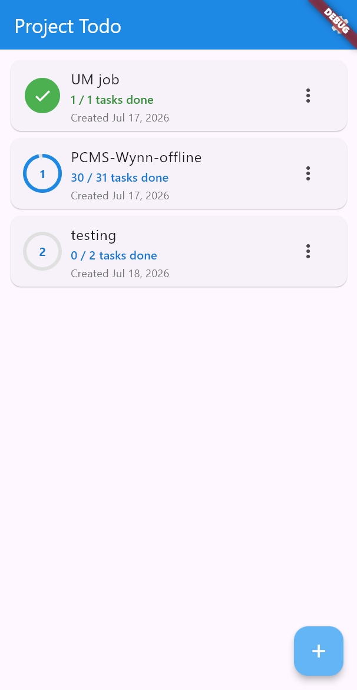
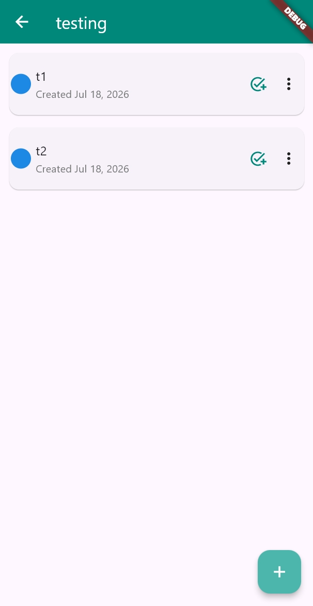
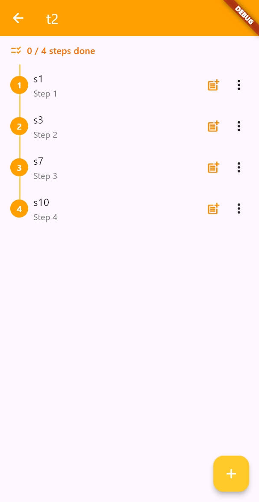

# Project Todo

A cross-platform, hierarchical task manager built with Flutter and backed by
[PocketBase](https://pocketbase.io/). Work is organized in three levels —
**Projects → Tasks → Steps** — so a large goal can be broken down into
subtasks and then into the concrete steps needed to finish each one.

- **Projects** are top-level containers. Each shows a circular progress ring
  with the number of outstanding tasks.
- **Tasks** live inside a project and form a *tree*: any task can have
  subtasks, rendered as an indented timeline with elbow connectors (like the
  `tree` command). Tasks can be folded to hide their descendants.
- **Steps** live inside a task and form a linear *chain*: an ordered,
  do-this-then-that checklist with a vertical connector linking each step to
  the next.

|  |  |  |
|:---:|:---:|:---:|
| **Project page** — progress rings & counts | **Task page** — indented task tree | **Step page** — ordered step chain |

---

## Features

### Projects
- Create, edit, and delete projects.
- A circular progress ring on each row shows how many tasks remain, turning
  into a green check when everything is done.
- Live `completed / total` counter per project.
- Pull to refresh; friendly empty and error states.

### Tasks
- Tasks are linked through `previousTaskId`, so a task can branch into any
  number of subtasks — a real tree, not just a flat list.
- The timeline draws proper `├──` / `└──` / `│` connectors so the structure
  is obvious at a glance.
- **Fold / unfold** any task to hide or reveal its descendants. The
  preference is persisted per task.
- **Due dates** with urgency coloring — red (overdue / due today), orange
  (within 72 hours), green (further out).
- **Urgency-aware sorting**: trees float to the top based on their most
  urgent incomplete task; fully finished trees sink to the bottom.
- Quick-toggle completion from the row badge, plus shortcuts to add a
  subtask or jump into the task's steps.

### Steps
- Steps form a single ordered chain inside a task, reconstructed from
  `previousStepId` links.
- Numbered badges and a vertical connector make the sequence explicit.
- **Mid-chain insertion**: splice a new step directly after any existing
  one; the chain is re-linked automatically so order is preserved.
- **Safe deletion**: deleting a step bridges the gap before removing it, so
  the successor is never orphaned.
- Compact `completed / total` summary at the top of the list.

### Connection & settings
- Connects to any PocketBase instance. API URL, username, and password are
  configured in-app via the Settings dialog and stored locally with
  `shared_preferences`.
- The Settings dialog validates the connection before closing, so you know
  immediately when something is wrong.

---

## Tech stack

| Layer | Technology |
| --- | --- |
| UI | Flutter (Material 3) |
| Backend | PocketBase (REST + auth) |
| Local config | `shared_preferences` |
| State | `StatefulWidget` + futures (no extra state library) |

The codebase is intentionally small and dependency-light. Three model
classes (`Project`, `Task`, `TaskStep`) flow through a single `APIService`
singleton into three pages.

---

## Project structure

```
lib/
├── main.dart                 # App entry; MaterialApp + HomePage
├── models.dart               # Project, Task, TaskStep data classes
├── adaptor.dart              # JSON ↔ model mapping (PocketBase <-> Dart)
├── api.dart                  # APIService singleton: all PocketBase calls
├── preferences.dart          # ConfigService: stores connection config
├── pages/
│   ├── project.dart          # Project list (home)
│   ├── task.dart             # Task tree for one project
│   └── step.dart             # Step chain for one task
└── components/
    ├── chainTimeline.dart    # Indented task-tree renderer with connectors
    ├── createProjectDialog.dart
    ├── createStepDialog.dart
    ├── createTaskDialog.dart
    ├── editProjectDialog.dart
    ├── editStepDialog.dart
    ├── editTaskDialog.dart
    ├── settingDialog.dart    # Connection config + test
    ├── errorMessageBox.dart
    ├── loadingProgressBar.dart
    └── successSnackBar.dart
```

---

## Getting started

### Prerequisites
- [Flutter](https://docs.flutter.dev/get-started/install) (SDK `^3.10.1`)

A PocketBase server is **not** something you need to install or configure
separately — the bundled binary in `server/` already contains the full
schema and seed data (see step 1 below).

### 1. Start the backend

The bundled PocketBase server lives at `server/pocketbase.exe`. Its
`pb_data/` folder already ships with the `users`, `projects`, `tasks`, and
`steps` collections, their relations, API rules, and basic seed data for
testing — so there is **no backend setup step**: just start it.

```bash
./server/pocketbase.exe serve
```

This serves the API at `http://127.0.0.1:8090` (the app's default API URL).
Leave this terminal running in the background.

### 2. Run the app

```bash
flutter pub get
flutter run
```

### 3. Connect to your backend

On first launch, the app is pre-filled with the seeded backend's defaults
so you can start immediately:

- **API URL** — `http://127.0.0.1:8090`
- **Username** — `admin@gmail.com`
- **Password** — `admin1234`

If you're running your own backend, open the **Settings** dialog (gear icon
in the top-right corner of the project page) and update the values to your
PocketBase base URL and a user from your `users` collection.

The dialog tests the connection before saving; once it succeeds, your
projects load automatically.

---

## Building for release

```bash
flutter build apk       # Android
flutter build appbundle # Android (AAB, for Play Store)
flutter build ios       # iOS
flutter build web       # Web
flutter build windows   # Windows
flutter build macos     # macOS
flutter build linux     # Linux
```

The app icon is generated from `assets/icon/app_icon.png` via
`flutter_launcher_icons`. To regenerate after changing the icon:

```bash
dart run flutter_launcher_icons
```

---

## Data model notes

The tree (tasks) and chain (steps) structures are both stored as linked
lists using a `previous*Id` self-reference rather than a separate join
table or array column. This keeps the schema portable across any backend
that supports relations, at the cost of some client-side graph walking:

- The **task forest** is rebuilt from `previousTaskId` in
  `lib/pages/task.dart` (`_buildTaskForest`), with cycle guards and a
  safety net so degenerate data never breaks the UI.
- The **step chain** is rebuilt from `previousStepId` in
  `lib/pages/step.dart` (`_orderSteps`), likewise defensive.
- **Mid-chain inserts and deletes** splice the linked list inside
  `APIService` (`insertStep`, `deleteStep`) so the chain never orphans a
  successor.

### Collection schema

These collections ship pre-created inside `server/pb_data/data.db`, so you
don't need to set them up. Field names must match the adaptors in
`lib/adaptor.dart`; the tables below are reference for anyone inspecting
or extending the bundled schema.

**`users`** — PocketBase's built-in auth collection.

**`projects`**

| Field | Type | Notes |
| --- | --- | --- |
| `name` | text | |
| `userId` | relation → `users` | |
| `isCompleted` | bool | default `false` |
| `completedAt` | date | nullable |
| `createdAt` | autodate | |
| `updatedAt` | autodate | |

**`tasks`**

| Field | Type | Notes |
| --- | --- | --- |
| `name` | text | |
| `projectId` | relation → `projects` | |
| `userId` | relation → `users` | |
| `isCompleted` | bool | default `false` |
| `dueDate` | date | nullable |
| `previousTaskId` | relation → `tasks` | self-reference; nullable (root task) |
| `completedAt` | date | nullable |
| `isFolded` | bool | default `false` |
| `createdAt` | autodate | |
| `updatedAt` | autodate | |

**`steps`**

| Field | Type | Notes |
| --- | --- | --- |
| `name` | text | |
| `taskId` | relation → `tasks` | |
| `isCompleted` | bool | default `false` |
| `previousStepId` | relation → `steps` | self-reference; nullable (chain head) |
| `createdAt` | autodate | optional — falls back to PocketBase `created` |
| `updatedAt` | autodate | optional — falls back to PocketBase `updated` |

Authenticated `users` have CRUD access to the `projects`, `tasks`, and
`steps` collections via the PocketBase API rules (also pre-configured).

---

## License

Distributed under the [Apache License 2.0](./LICENSE).
